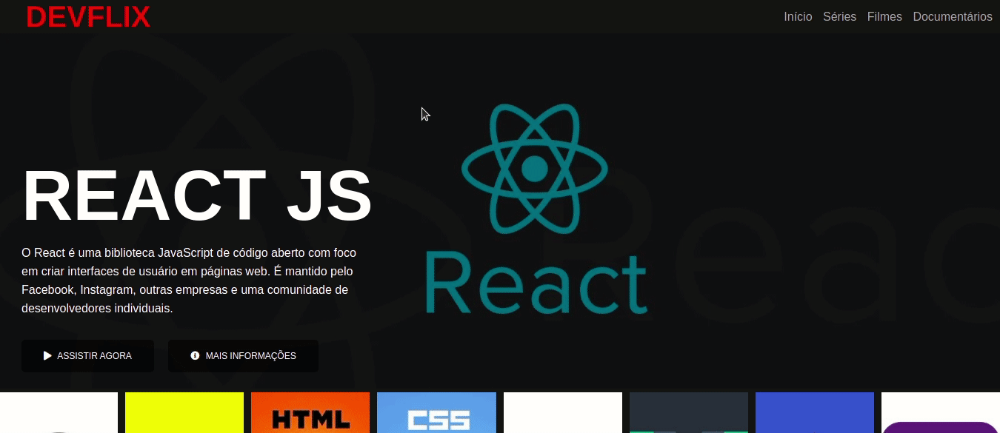

# DEVFLIX

## Descrição

Clone da interface da Netflix, projeto do bootcamp **MRV Front End SPA Developer da Digital Innovation One**. Neste projeto tive a aportunidade de relembrar alguns conceitos do **HTML5** e do **CSS3**, como tags semânticas, responsividade com media queries e o conceito de utilizar variáveis no CSS, que até então eu pensava que era somente possível com a utilização de frameworks.

Também foi utilizado o **JQuery** para implementar a lista de filmes que fica logo abaixo do banner principal, a biblioteca utilizada foi a [OWL Carousel](https://owlcarousel2.github.io/OwlCarousel2/).

## Agradecimentos

Venho agradecer a [Digital Innovation One](https://digitalinnovation.one/) e ao instrutor [Felipe Aguiar Code](https://github.com/felipeAguiarCode).

### Tecnologias utilizadas

- HTML5
- CSS3
- Javascript
- JQuery
